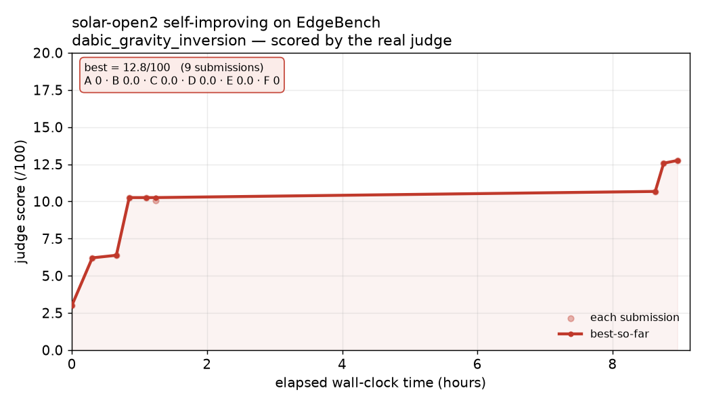

# solar-open2-lab

A **24/7 self-improving agent loop** driven by Upstage **Solar** (`solar-open2`), pointed at a
**real, hard research benchmark** — ByteDance's [EdgeBench](https://github.com/ByteDance-Seed/EdgeBench)
`dabic_gravity_inversion` task — and scored by **EdgeBench's own hidden judge**.

Solar reads the D-ABIC paper, writes SimPEG code, runs it, gets scored 0–100 by the real judge,
reads the per-component feedback, and improves — over and over. It's the EdgeBench protocol
(iterate → submit → judge → keep the best) with Solar as the brain.

> EdgeBench is deliberately brutal: even frontier models reach only ~15–20/100 at 12h on this task.
> The point isn't to win the leaderboard — it's a genuine, verifiable metric for a self-improving loop.

## Live learning curve

`solar-open2`'s judge score on this single task vs elapsed wall-clock time (best-so-far
envelope + each submission). Auto-regenerated from the run's SQLite store as it improves —
same idea as EdgeBench's own time-vs-performance curves, for one model on one task.



```bash
python scripts/plot_curve.py         # regenerate assets/dabic_curve.png from outputs/dabic.sqlite
```

## Why this is "real"

- The task **data, SimPEG environment, and the grading judge** come from EdgeBench's **public Docker
  images** (`seededge/edgebench.{work,judge}.dabic_gravity_inversion`), not a reconstruction.
- Scoring is the **actual** `eval_dabic_v2.py` (100 pts: A static-scan · B synthetic · C hidden
  scenarios · D Vinton field data · E behavior-fingerprint · F report).
- Solar's edits run in the **work** container (SimPEG); scoring runs in the **judge** container.

## Setup

```bash
# 1. Docker runtime (macOS: colima with Apple-Virtualization + Rosetta for amd64 images)
brew install colima docker
colima start --vm-type vz --vz-rosetta --cpu 6 --memory 12 --disk 60

# 2. Pull the public task + judge images (linux/amd64)
docker pull --platform linux/amd64 seededge/edgebench.work.dabic_gravity_inversion:85db0aba8a5f
docker pull --platform linux/amd64 seededge/edgebench.judge.dabic_gravity_inversion:517eb738b87b

# 3. Python env + key
uv sync                 # or: pip install -e .
cp .env.example .env     # add UPSTAGE_API_KEY

# 4. Stage the reference files Solar reads (extracted from the work/judge images; gitignored)
python scripts/extract_resources.py
```

## Run

```bash
python run_dabic.py --max-turns 3          # quick smoke test
python run_dabic.py --minutes 720          # a 12-hour EdgeBench-style run
python dashboard.py                        # print the score curve
```

## How it works

```
edgelab/
  docker_env.py   run code in the WORK container; score with the JUDGE container
  tools.py        the agent's toolset: read refs, read/write outputs/, run_work, score
  prompts.py      mission + scoring rules given to Solar
  agent.py        one improvement turn = a bounded Solar tool-calling loop
  store.py        SQLite: every submission + A–F breakdown, best-across-submissions, lessons
  harness.py      the 24/7 loop + context summarization (bounded context forever)
solar/            thin OpenAI-compatible client for the Solar API (solar-open2 is a reasoning model)
```

Each turn Solar inspects the latest judge feedback, edits the deliverables
(`dabic_directive.py`, `run_synthetic.py`, `run_vinton.py`, `results.json`, `report.md`), tests them
in the SimPEG container, and re-scores. The **best score across all submissions** is kept (EdgeBench's
rule); history is periodically compressed into `lessons` so the loop can run indefinitely.

## What is NOT in this repo (and why)

`resources/` (the D-ABIC / Xu papers and the EdgeBench task internals + judge) and `workspace/`
(agent output) are **gitignored**. The papers are copyrighted (SEG/*Geophysics*) and the task/judge
belong to ByteDance — pull them locally from the public images; this repo ships only *our* harness.

## Notes

- `solar-open2` is a **reasoning** model — keep `max_tokens` generous; usage reports `reasoning_tokens`.
- amd64 images run under emulation on Apple Silicon (correct, but slow). For serious 24/7 runs, host
  the loop on a native **linux/amd64** box.
